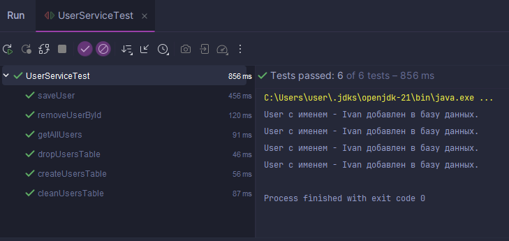

# Welcome
## Training Pre-Project: Task 1.1.2 - Working with DB and Using JDBC

---

## Setup
- Project with Maven
- DB: MySQL
- JDK: 17

---

## Requirements:

1. Classes `dao/service` must implement corresponding interfaces.
2. The `dao` class should have a default/empty constructor.
3. All fields must be private.
4. `service` should reuse methods from `dao`.
5. Handling all exceptions related to database operations should be within `dao`.
6. The `Util` class should contain logic for configuring the database connection.

---

## Operations:

1. **Create Table for Users:**
    - Should not throw an exception if the table already exists.

2. **Delete Users Table:**
    - Should not throw an exception if the table does not exist.

3. **Clear Users Table:**

4. **Add User to the Table:**

5. **Delete User from the Table (by id):**

6. **Retrieve All Users from the Table:**

---

## Application Workflow

In the `main` method of the `Main` class, perform the following operations:

- Create a table for Users.
- Add 4 Users to the table with data of your choice. After each addition, a message should be printed to the console.
- Retrieve all Users from the database and print them to the console.
- Clear the Users table.
- Delete the Users table.